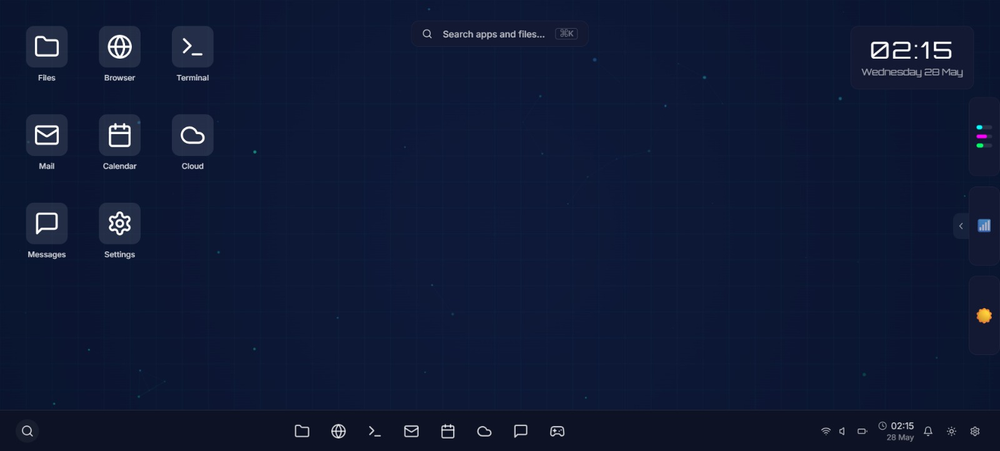

# 🚀 Futurise Desktop

<div align="center">

[](https://www.typescriptlang.org/)
[](https://reactjs.org/)
[](https://vitejs.dev/)
[](https://tailwindcss.com/)

[](https://futurise-desktop.lovable.app/)

</div>

## ✨ Overview

Futurise Desktop is a cutting-edge web application that combines modern technologies to deliver an exceptional user experience. Built with performance and scalability in mind, it represents the future of desktop applications in the browser.

## 🛠️ Tech Stack

<div align="center">

| Category | Technologies |
|----------|--------------|
| **Frontend Framework** | ⚛️ React |
| **Language** | 📘 TypeScript |
| **Build Tool** | ⚡️ Vite |
| **UI Components** | 🎨 shadcn-ui |
| **Styling** | 🎯 Tailwind CSS |

</div>

## 🚀 Getting Started

### Prerequisites

- Node.js (LTS version recommended)
- npm or yarn
- Git

### Installation

```bash
# Clone the repository
git clone <YOUR_GIT_URL>

# Navigate to project directory
cd futurise-desktop

# Install dependencies
npm install

# Start development server
npm run dev
```

## 💻 Development

### Local Development

1. Start the development server:
   ```bash
   npm run dev
   ```
2. Open [http://localhost:5173](http://localhost:5173) in your browser
3. Start coding!

### Alternative Development Methods

#### GitHub Direct Editing
1. Navigate to the file you want to edit
2. Click the "Edit" button (pencil icon)
3. Make your changes and commit

#### GitHub Codespaces
1. Go to repository main page
2. Click "Code" button
3. Select "Codespaces" tab
4. Create new codespace
5. Edit and commit changes

## 🌐 Deployment

The application is currently deployed and accessible at:
[https://futurise-desktop.lovable.app/](https://futurise-desktop.lovable.app/)

## 🤝 Contributing

We welcome contributions! Here's how you can help:

1. Fork the repository
2. Create your feature branch (`git checkout -b feature/AmazingFeature`)
3. Commit your changes (`git commit -m 'Add some AmazingFeature'`)
4. Push to the branch (`git push origin feature/AmazingFeature`)
5. Open a Pull Request

## 📸 Screenshots

Below are screenshots of the application:

<div align="center"> 
  <table>
    <tr>
      <td align="center"><br/><sub>Screenshot 1</sub></td>
      <td align="center"><br/><sub>Screenshot 2</sub></td>
      <td align="center"><br/><sub>Screenshot 3</sub></td>
      <td align="center"><br/><sub>Screenshot 4</sub></td>
    </tr>
    <tr>
      <td align="center"><br/><sub>Screenshot 5</sub></td>
      <td align="center"><br/><sub>Screenshot 6</sub></td>
      <td align="center"><br/><sub>Screenshot 7</sub></td>
      <td align="center"><br/><sub>Screenshot 8</sub></td>
    </tr>
  </table>
</div>

<div align="center">
Made with ❤️ by the Rajput Nirajsingh
</div>
